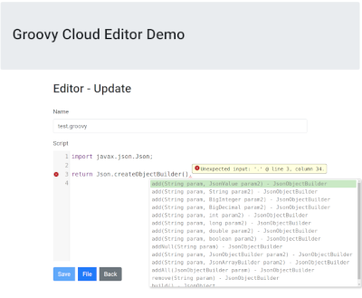
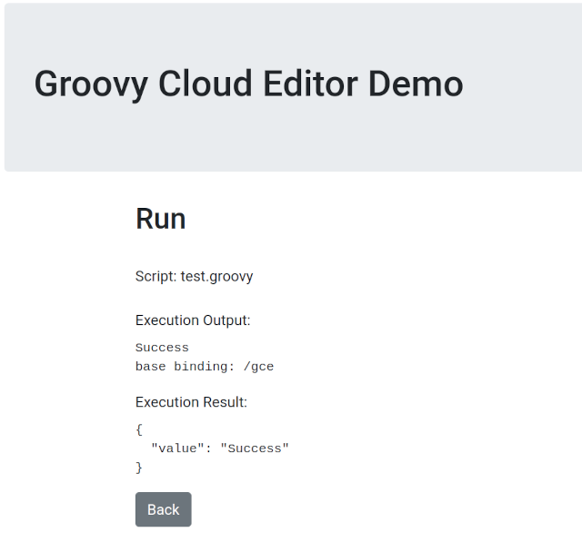

# Groovy Cloud Editor #

A reference Java and Javascript hybrid web application for developing, storing, and running Groovy scripts in the Cloud. The objective is to develop simple Groovy scripts that leverage the full power of the Java platform and ecosystem in the browser, interpret the scripts server-side, and ultimately provide execution results back to the browser.

Contributors are welcome.

## Develop ##
[CodeMirror](https://codemirror.net/) is used as an in-browser code editor for developing Groovy scripts.

#### Syntax Highlighting ####
The CodeMirror 5 editor supports over 100 language grammars and Groovy is one of them. The Groovy language mode option stylizes the editor for the Groovy syntax including keyword highlights and tokenization.

#### Hint ####
CodeMirror provides a hint add-on that can further be extended for a given language. Hin implementations for Javacript, CSS, and XML by default. This web application includes a custom hint extension for Groovy that sends the current script value to the server-side where it is slightly adjusted if needed to compile, parsed, analyzed, and the results returned back to CodeMirror for prompting.

#### Lint ####
Similar to the hint add-on, a custom CodeMirror lint extension is included to send the current script value to the server, parse it, and send any syntax errors back to CodeMirror for presentation.

### Run ###

Valid Groovy scripts are sent to the server-side where they are executed using the Groovy Java API.

## Building and Running  ##

## Considerations ##

#### Public Repository ####
This application relies on both Javascript and Java interdependent assets and publishing them independently would be impractical. The source code is available under the Apache 2.0 license and may be selectively used as desired.

#### Usage ####
This reference application is not intended to be included in a commercial product but it may be viable for restricted use in internal applications. There are several factors for this recommendation:

* Executing external dynamic code is inherently unsafe. Please see the security section below.

* Performance could be a limiting factor. This application generates numerous network requests based on user interaction. Each of these requests contain the full uncompressed script text. On the server-side the scripts are partially compiled to detect errors and evaluate contextual hint. Additionally the scripts are executed on the same server instance. With these multiple variables it may be challenging to accurately predict server load and scalability requirements.

* The server-side implementation of the hint options is a best effort based on crude syntax tree heuristics. While it may be sufficient for the limited use cases included in the test suites it may not be robust enough for large scale adoption.

Traditional data conversion or test case management are problem spaces where this application would be appropriate. The user base is limited, users are accountable, the scripts are simple, and work can be rapidly developed and executed without a complete  traditional deployment pipeline.

#### Security ####

Whenever dealing with unverified code execution security is of paramount importance. Always consider the implications of an unauthorized actor gaining full access to the Groovy runtime and executing malicious scripts.

There are three approaches to securing Groovy scripts:

1. [Secure AST customizer](https://docs.groovy-lang.org/docs/next/html/documentation/core-domain-specific-languages.html#_secure_ast_customizer) - A bytecode inspector that restricts access to designated Java APIs methods. This is the technique incorporated into this application. This is a superficial security because a determined malicious actor can potentially work around the restrictions.

1. [Sandboxing](https://github.com/jenkinsci/groovy-sandbox) - Not officially supported outside of Jenkins, most likely due to liability reasons. Another option would to build a dedicated isolated docker image with highly restrictive file and network access rules. Even if a malicious actor gained access they would have restricted access.

1. Java JVM Security Manager Policy File - API access is limited at the JVM level. This is the most secure method of restricting access to the scripts but it does require additional configuration and a minor performance hit. Read this excellent [Groovy security write up](https://levelup.gitconnected.com/secure-groovy-script-execution-in-a-sandbox-ea39f80ee87) for more information on this approach.

#### Advanced Scripts ####
Normally the server-side hint implementation partially compiles the scripts up to the syntax analysis phase so that the full AST is available for inspection. However if the script is considered complex, in that includes function definitions or inner classes, it will perform a full Groovy script compile and then process the resulting bytecode in ClassGraph so that it is available for hint inspection.

#### CodeMirror 6 ####

[CodeMirror 6](https://codemirror.net/6/) is a major rewrite and is currently in beta. CodeMirror 6 uses [Language Packages](https://codemirror.net/6/examples/lang-package/) and  require a parser such as a [Lezer](https://lezer.codemirror.net/) grammar. CodeMirror 6 does support [autocomplete](https://codemirror.net/6/docs/ref/#autocomplete).

Currently a Lezer parser for Groovy is unavailable although one could be created based off of the [Java](https://github.com/lezer-parser/java/blob/master/src/java.grammar) one.  With CodeMirror 6 full parsing the autocomplete/hint functionality could be greatly simplified by sending only contextual AST data server-side instead of the whole script for Java reflection. Additionally with most of the syntax validation performed in the parser only a single full script validation on the server-side would be necessary before persisting the script.

#### Key Assets ####

* [editor.js](src/main/web/components/editor.ts) - Web Component wrapper around CodeMirror. It contains all CodeMirror extensions and configurations.

* [GroovyCloudEditorRS.java](src/main/java/com/github/aaronanderson/gce/GroovyCloudEditorRS.java) - Java JAX-RS endpoint that provides all server-side functionality for hint option discovery, script validation, and script execution.

* [AutoCompleteAnalyzer.java](src/main/java/com/github/aaronanderson/gce/AutoCompleteAnalyzer.java) - Groovy  analyzer used to inspect the Groovy abstract syntax tree (AST) and generate contextual hints.

### Key Bindings ###

* __CTRL + SPACE__ - Initiate a hint/autocomplete request
* __CTRL + S__  - Save the script after validation is performed.
* __F11__ - Enter fullscreen
* __ESC__ - Exit fullscreen

### Future Work ###

* Auto-import - incomplete initial support. Java import statements, if missing, could be automatically inserted upon hint selection.

* Hover Details - Once the hint selection is complete the displayed Java type information is unavailable. This metadata could be saved in the CodeMirror data model or tokens and then and pop-up as a tooltip for future reference.

* Multiple Scripts - Minimal effort would be needed to group multiple scripts together for code editing linking and execution.         

### Design ###

#### JavaScript ####

* [TypeScript](https://www.typescriptlang.org/) all browser code is written in TypeScript.

* [Lit](https://lit.dev/) web components are used for the UI views.

* [Bootstrap](https://getbootstrap.com/) is used for the UI theme.

* [Redux](https://redux.js.org/) and [Immer](https://immerjs.github.io/immer/) are used for state management.

* [IDB](https://github.com/jakearchibald/idb#readme) is used for managing script files in local browser storage.

* [Vaadin Router](https://vaadin.com/router) is used for browser navigation.

* [Snowpack](https://www.snowpack.dev/) is for bundling the web assets.

#### Java ####

* [Amazon Corretto 16 JDK](https://docs.aws.amazon.com/corretto/latest/corretto-16-ug/downloads-list.html) is the JVM this application was developed with.

* [Quarkus](https://quarkus.io/) is the application server used to serve web assets and service REST requests.

* [ClassGraph](https://github.com/classgraph/classgraph) is used to scan the Quarkus web application claspath at startup and then the cached result is queried for hints at runtime.

* [JimFS](https://github.com/google/jimfs) is used in advanced script compilation in order for ClassGraph to scan the script byte code without any native file IO.

* [Apache POI](https://poi.apache.org/) is used for the Excel file parsing script example.

* [Apache Maven](https://maven.apache.org/) and the [Front End Plugin](https://github.com/eirslett/frontend-maven-plugin) is used to build and bundle the Javascript and Java code.

This web application was inspired by the archived [codemirror-latex-hint](https://github.com/jun-sheaf/codemirror-latex-hint) repository.
